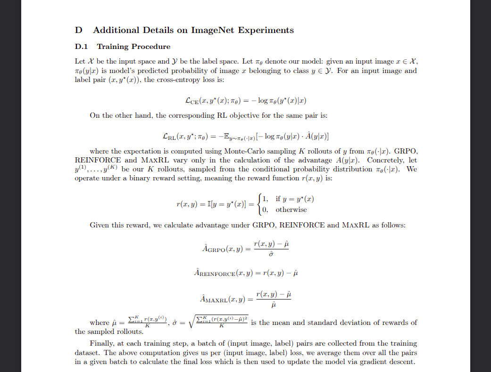
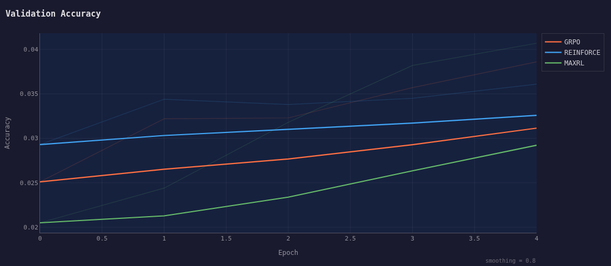
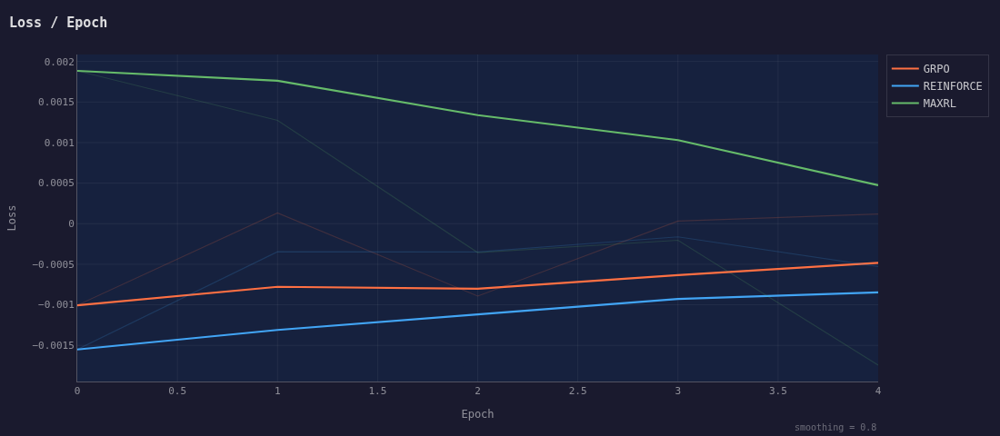
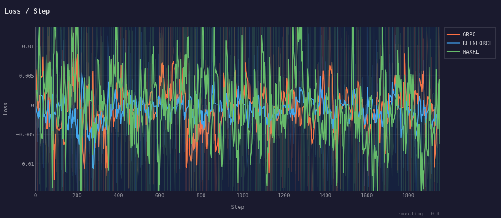
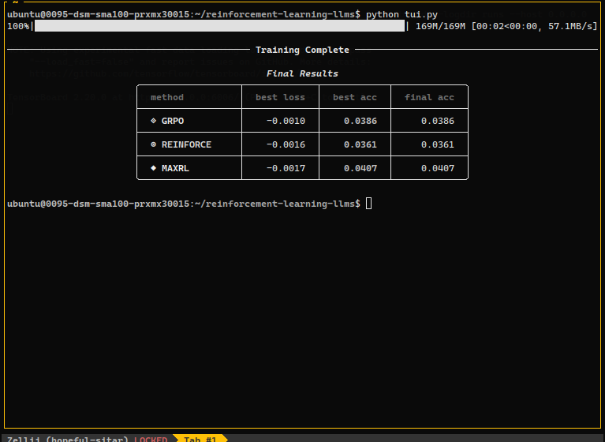

# Maximum Likelihood Reinforcement Learning — CIFAR-100

A minimal reproduction of the image-classification experiments from the paper:

> **Maximum Likelihood Reinforcement Learning**
> Fahim Tajwar, Guanning Zeng, Yueer Zhou, Yuda Song, Daman Arora, Yiding Jiang, Jeff Schneider, Ruslan Salakhutdinov, Haiwen Feng
> arXiv:2602.02710 · February 2026
> [https://arxiv.org/abs/2602.02710](https://arxiv.org/abs/2602.02710)

---

## Overview

The paper argues that standard RL methods (like GRPO and REINFORCE) optimise only a **lower-order approximation** of the likelihood over correct rollouts, rather than the likelihood itself. The authors introduce **MaxRL** — a sampling-based framework that interpolates between standard RL and exact maximum likelihood as more sampling compute is allocated, converging to MLE in the infinite-compute limit.

This repo trains a **ResNet-18** on **CIFAR-100** using three advantage estimators side-by-side:

| Method | Advantage $\hat{A}(x, y)$ | Notes |
|---|---|---|
| **GRPO** | $\dfrac{r(x,y) - \hat{\mu}}{\hat{\sigma}}$ | normalise by std |
| **REINFORCE** | $r(x,y) - \hat{\mu}$ | subtract mean baseline |
| **MaxRL** | $\dfrac{r(x,y) - \hat{\mu}}{\hat{\mu}}$ | divide by mean; upweights hard examples |

where $\hat{\mu} = \frac{1}{K}\sum_{i=1}^{K} r(x, y^{(i)})$ and $\hat{\sigma} = \sqrt{\frac{1}{K}\sum_{i=1}^{K}(r(x,y^{(i)}) - \hat{\mu})^2}$, computed over $K$ Monte-Carlo rollouts sampled from the model's current policy.

The reward function is binary:

$$r(x, y) = \mathbb{1}[y = y^*(x)] = \begin{cases} 1 & \text{if } y = y^*(x) \\ 0 & \text{otherwise} \end{cases}$$

The RL objective being optimised is:

$$\mathcal{L}_{\text{RL}}(x, y^*; \pi_\theta) = -\mathbb{E}_{y \sim \pi_\theta(\cdot|x)}\left[-\log \pi_\theta(y|x) \cdot \hat{A}(y|x)\right]$$

---

## Results

### Experiment Overview



### Validation Accuracy



### Training Loss per Epoch



### Training Loss per Step



### Final Results



---

## Setup

```bash
bash install.sh
```

---

## Training

**Plain terminal output:**
```bash
python train.py
```

**Rich TUI (live progress dashboard):**
```bash
python tui.py
```

Training runs all three advantage functions sequentially — GRPO → REINFORCE → MaxRL — and logs metrics to TensorBoard under `runs/`.

```bash
tensorboard --logdir runs/
```

---

## Generating Plots

After training, export the CSVs from TensorBoard into `data/` (one file per metric per algorithm, named `cifar100_{algo}_{metric}.csv`) and run:

```bash
python graphs.py
```

This produces TensorBoard-style dark-theme plots with EMA smoothing for all three metrics: `acc/val`, `loss/epoch`, and `loss/step`.

---

## Config

| Hyperparameter | Value |
|---|---|
| Model | ResNet-18 (random init) |
| Dataset | CIFAR-100 |
| Epochs | 5 |
| Batch size | 128 |
| Rollouts $K$ | 4 |
| Learning rate | 0.1 (cosine annealed) |
| Optimizer | SGD + momentum 0.9 |
| Mixed precision | AMP (fp16) |

---

## Citation

```bibtex
@article{tajwar2026maxrl,
  title   = {Maximum Likelihood Reinforcement Learning},
  author  = {Tajwar, Fahim and Zeng, Guanning and Zhou, Yueer and Song, Yuda and
             Arora, Daman and Jiang, Yiding and Schneider, Jeff and
             Salakhutdinov, Ruslan and Feng, Haiwen},
  journal = {arXiv preprint arXiv:2602.02710},
  year    = {2026},
  url     = {https://arxiv.org/abs/2602.02710}
}
```
