# Unsloth + TRL GRPO (GSM8K)

This directory contains an experimental reinforcement learning pipeline for mathematical reasoning with **Unsloth** and **TRL GRPO**.
The training script fine-tunes a Qwen-family causal language model on GSM8K-style prompts, uses structured reward shaping, and logs training signals that are post-processed into TensorBoard-style metric figures.

## Research Objective

The implementation studies whether GRPO-based policy optimization improves response quality for arithmetic reasoning under a constrained output format:

- reasoning trace in `<think>...</think>`
- final answer in `\\boxed{...}`

The optimization objective combines:

- **accuracy reward**: exact match between extracted boxed answer and GSM8K ground truth
- **format reward**: adherence to the required reasoning + boxed-answer structure

## Core Training Script

Primary script: `unsloth_grpo.py`

### Method Summary

- Loads model via `FastLanguageModel.from_pretrained` using `model_name = "Qwen/Qwen3-8B"`
- Applies LoRA adapters through Unsloth PEFT integration (`r=16`, `lora_alpha=32`)
- Loads dataset: `openai/gsm8k` (`train` split)
- Maps prompts with an explicit system instruction block for reasoning and boxed answers
- Trains with `GRPOTrainer` and `GRPOConfig`
- Reports metrics to TensorBoard-compatible logs (`report_to="tensorboard"`)
- Saves final model checkpoint at training end

### Notable Hyperparameters (from script)

- epochs: `1`
- batch size per device: `8`
- gradient accumulation: `4`
- learning rate: `2e-4`
- optimizer: `adamw_8bit`
- scheduler: cosine with warmup (`warmup_steps=100`)
- generations per prompt: `8`
- max prompt length: `256`
- sampling: `temperature=0.7`, `top_p=0.95`

## Plotting Pipeline

CSV metric files are stored in `csv/`.

Plot generation code is in `plot_scripts/`:

- `metric_plotter.py`: shared plotting utility (EMA smoothing, robust y-range, image export)
- `run_all_metrics.py`: generates all metric plots in one command
- `plot_*.py`: one script per metric
- `tensorboard_style_plots.py`: alternative HTML plotting workflow

Output figures are written to `plots/`.

## Reproducibility

### 1) Environment dependencies

Install Python dependencies required by training and plotting:

```bash
pip install torch datasets transformers trl unsloth rich pandas numpy plotly kaleido
```

### 2) Run training

From this directory (`src/unsloth_trl`):

```bash
python unsloth_grpo.py
```

### 3) Generate all plots

From this directory (`src/unsloth_trl`):

```bash
python plot_scripts/run_all_metrics.py
```

## Directory Layout

```text
unsloth_trl/
├── unsloth_grpo.py
├── csv/
│   ├── accuracy_r_mean.csv
│   ├── clipped_ratio.csv
│   ├── completion_length.csv
│   ├── forward_r_mean.csv
│   ├── grad_norm.csv
│   ├── kl.csv
│   ├── loss.csv
│   ├── lr.csv
│   ├── reward.csv
│   └── reward_std.csv
├── images/
│   ├── eval.png
│   └── train_endlog.png
├── plot_scripts/
│   ├── metric_plotter.py
│   ├── run_all_metrics.py
│   └── plot_*.py
└── plots/
    ├── accuracy_r_mean_tb.png
    ├── clipped_ratio_tb.png
    ├── completion_length_tb.png
    ├── forward_r_mean_tb.png
    ├── grad_norm_tb.png
    ├── kl_tb.png
    ├── loss_tb.png
    ├── lr_tb.png
    ├── reward_tb.png
    └── reward_std_tb.png
```

## Training and Evaluation Images

### Evaluation Snapshot

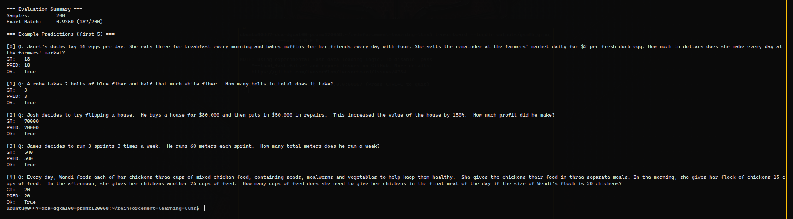

### End-of-Training Console Snapshot

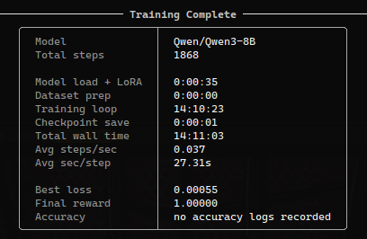

## Metric Plots

### Accuracy (r_mean)

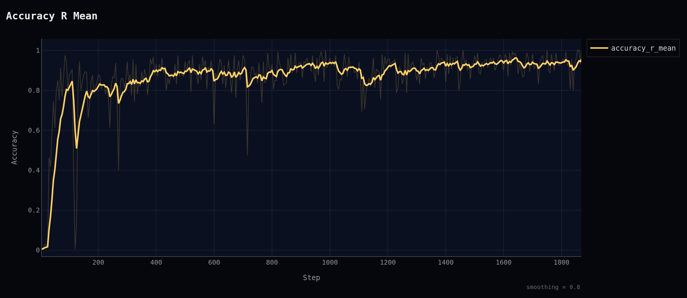

### Clipped Ratio

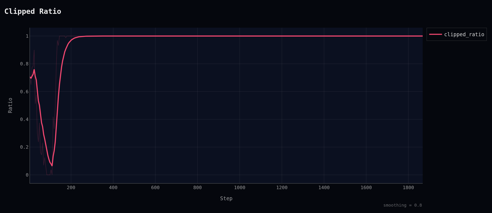

### Completion Length

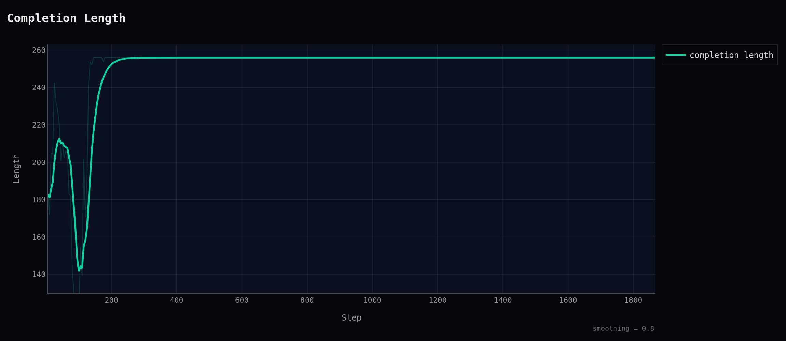

### Forward Reward Mean

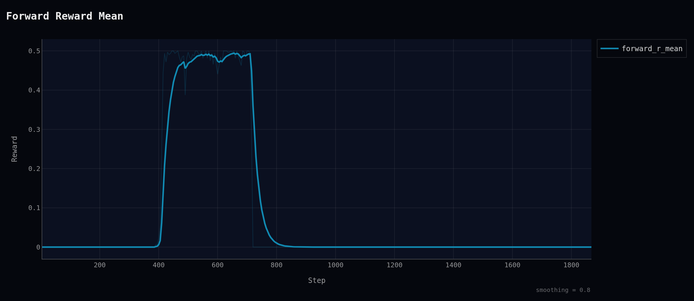

### Gradient Norm

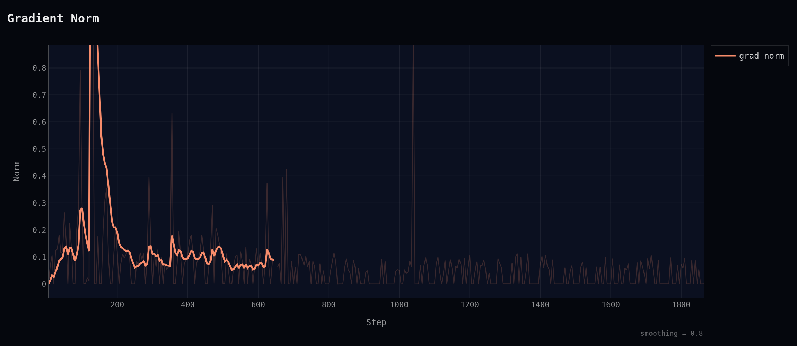

### KL Divergence

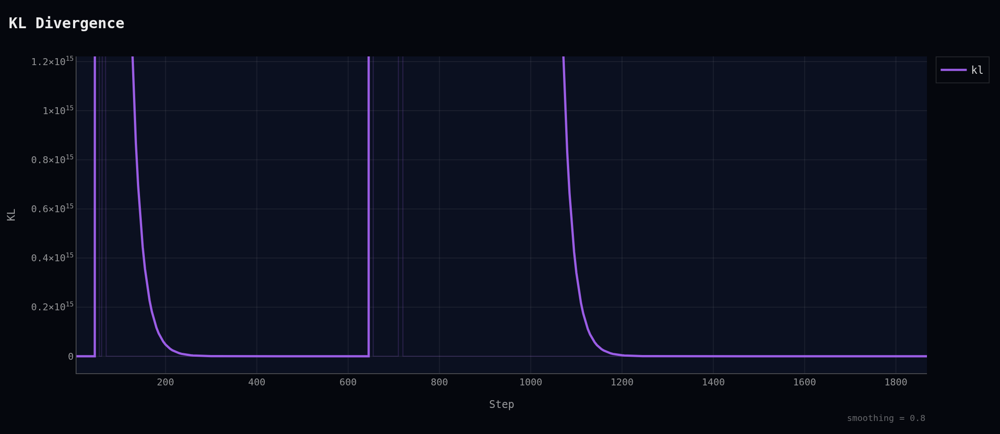

### Loss

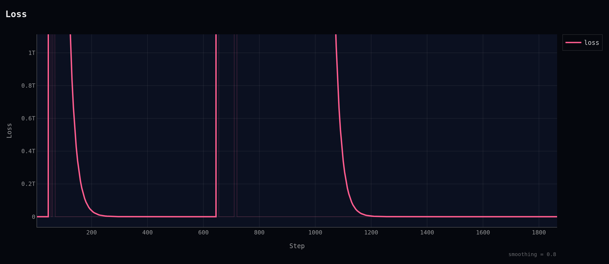

### Learning Rate

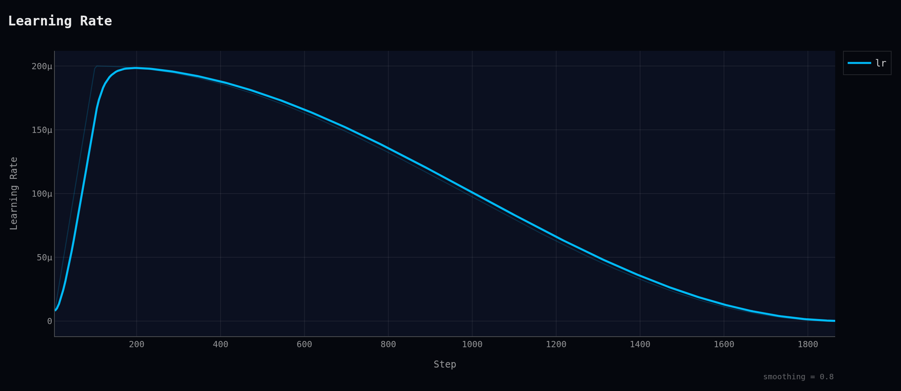

### Reward

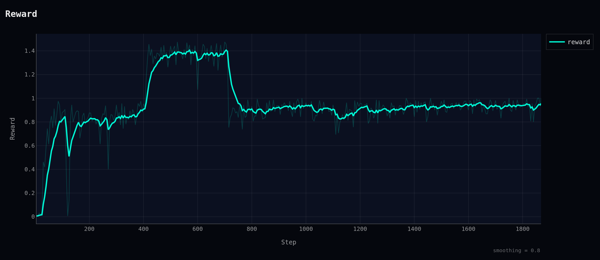

### Reward Standard Deviation

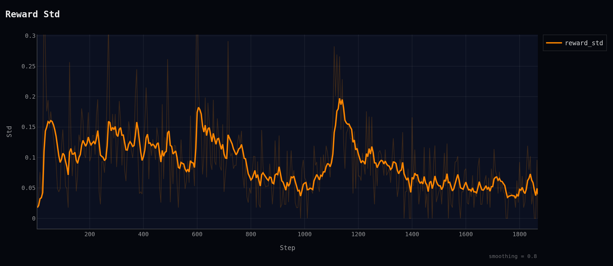

## Notes

- Plot image export depends on `kaleido`; install it if `write_image` fails.
- The metric plotting scripts expect CSV files with columns `Step` and `Value`.
- This folder is organized for reproducible training diagnostics and report-ready visual outputs.